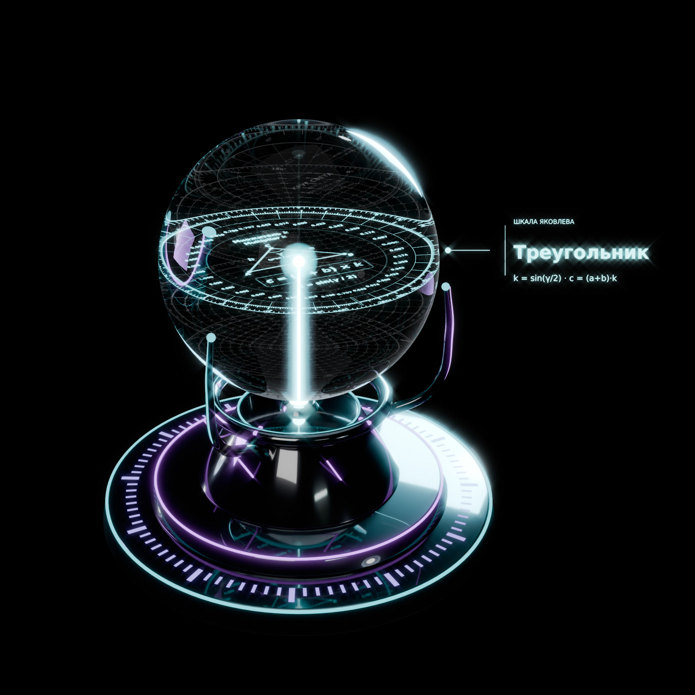

# Шкала Яковлева / Yakovlev Scale

Шкала Яковлева — круговая номограмма для быстрого определения третьей стороны треугольника по двум известным сторонам и углу между ними.

Yakovlev Scale is a circular nomogram for quickly determining the third side of a triangle from two known sides and the angle between them.

$$c = (a + b) \cdot k, \qquad k = \sin(\gamma / 2)$$

## Основа / Basis

Шкала Яковлева — удобная шпаргалка на основе классической формулы длины хорды: для двух равных сторон $a$ третья сторона равна $c = 2a \sin(\gamma/2)$. Таблицы хорд известны со времён Птолемея (II век н. э.), а номограммы для треугольников широко применялись до появления калькуляторов. Новое здесь — не математика, а подача: наглядная круговая шкала и готовая таблица, по которым третью сторону можно прикинуть без синусов и корней.

The Yakovlev Scale is a practical cheat sheet based on the classic chord-length formula: for two equal sides $a$, the third side is $c = 2a \sin(\gamma/2)$. Chord tables date back to Ptolemy (2nd century AD), and triangle nomograms were widely used before calculators. What is new here is not the mathematics but the presentation.

Сайт / Website: https://shkalayakovleva.github.io/

## 1. Шкала Яковлева (цветная номограмма) / Yakovlev Scale (colour nomogram)

По кругу отложены углы от 0° до 360°, и против каждого угла стоит готовый множитель $k = \sin(\gamma/2)$.

Как пользоваться:

1. Найдите угол между известными сторонами.
2. Возьмите на шкале множитель $k$ напротив этого угла.
3. Сложите известные стороны: $a + b$.
4. Умножьте сумму на множитель.
5. Получится третья сторона: $c = (a + b) \cdot k$.

Синусы и корни считать не нужно, хватит одного сложения и одного умножения.

Для равнобедренного треугольника ($a = b$) результат точный. Если стороны разные, шкала даёт немного заниженную оценку, и чем сильнее различаются стороны, тем больше погрешность. При сторонах 3 и 4 и угле 90° шкала даёт 4,95 вместо точных 5, это около 1%. Шкала подходит для прикидок в столярке, раскрое, разметке и на уроках геометрии, где скорость важнее третьего знака после запятой.

**Пример:** $a = 5$, $b = 5$, $\gamma = 90°$, $k = 0{,}707$, $c = (5 + 5) \cdot 0{,}707 \approx 7{,}07$.

## 2. Готовая круговая шпаргалка / Ready-made cheat sheet

Рабочая таблица по шкале Яковлева, где уже ничего не нужно умножать. Каждое кольцо соответствует сумме двух равных сторон, от 1 до 10 см. Лучи показывают угол между сторонами, от 0° до 360°. На пересечении кольца и луча написана готовая длина третьей стороны.

Например, у двух сторон по 5 см (кольцо «10 см») с углом 90° третья сторона равна 7,07 см.

Правая половина круга (0°–180°) основная, левая (180°–360°) зеркальная: углы γ и 360° − γ дают одно и то же число. Внизу листа есть краткая инструкция и пример.

Шпаргалка точна для равнобедренных треугольников и удобна, когда нужно быстро найти хорду, раствор циркуля или расстояние между концами двух одинаковых планок под заданным углом. Её можно распечатать и держать у рабочего места.

## Как читать / How to read

Две картинки читаются по-разному, не путайте их.

1. **Цветная шкала** даёт **множитель** $k$, а не длину. Его нужно умножить на сумму сторон $a + b$. При угле 120° $k = 0{,}866$.
2. **Круговая шпаргалка** даёт **готовую третью сторону** для суммы, написанной на кольце. Умножать ещё раз не нужно. Если ваша сумма $S$ другая, пересчитайте: число × $S$ / кольцо.

**Пример:** угол 120°, кольцо «7 см» → 6,06 (это 7 × 0,866). Это уже третья сторона для суммы 7 см. Для суммы 17 см: 17 × 0,866 ≈ 14,7, или по шпаргалке 6,06 × 17 / 7 ≈ 14,7. Ошибка: умножить 6,06 на 17 (получится 103, это неверно).

Формула точна только при $a = b$. Если стороны разные, результат немного занижен.

The two pictures are read differently:

1. **Colour scale** gives a **multiplier** $k$, not a length. Multiply it by the sum $a + b$. At 120°, $k = 0.866$.
2. **Circular cheat sheet** gives the **ready third side** for the sum written on the ring. Do not multiply again. For a different sum $S$, rescale: value × $S$ / ring.

**Example:** 120°, ring "7 cm" → 6.06 (= 7 × 0.866), already the third side for a sum of 7 cm. For a sum of 17 cm: 17 × 0.866 ≈ 14.7, or 6.06 × 17 / 7 ≈ 14.7. Wrong: 6.06 × 17 = 103.

The formula is exact only when $a = b$; for unequal sides it slightly underestimates.

## 3. Прямой угол / Right angle

Две картинки для любого прямоугольного треугольника: по двум известным сторонам найти острые углы и третью сторону. Здесь нет допущения $a = b$, результат точен в пределах точности чтения шкалы.

**Цветная номограмма.** Разделите меньшую сторону на большую: $r$ = меньшая / большая (от 0 до 1), найдите $r$ на внешнем цветном кольце и прочитайте ячейку своего кольца:

- кольцо ① «Два катета»: $\alpha = \operatorname{arctg} r$;
- кольцо ② «Катет и гипотенуза»: $\alpha = \arcsin r$.

$\alpha$ — острый угол напротив меньшей стороны, $\beta = 90° - \alpha$. Третья сторона = большая сторона × множитель из ячейки (① $\sqrt{1 + r^2}$ — гипотенуза, ② $\sqrt{1 - r^2}$ — второй катет).

**Готовая шпаргалка.** Кольца — большая сторона 1–10 см, числа — готовая меньшая сторона, угол $\alpha$ читается на краю круга. Правая половина — ① «Два катета» ($\alpha$ от 0° до 45°), левая — ② «Катет и гипотенуза» ($\alpha$ от 0° до 90°). Если большая сторона больше 10 см или дробная, приведите её к 10: меньшая × 10 / большая, и ищите на кольце 10.

**Пример:** стороны 2 и 13, $r = 2 / 13 \approx 0{,}154$ (на шпаргалке: 2 × 10 / 13 ≈ 1,54 на кольце 10).

- Катеты 13 и 2: $\alpha \approx 8{,}7°$, $\beta \approx 81{,}3°$, гипотенуза ≈ 13 × 1,012 ≈ 13,15.
- Гипотенуза 13 и катет 2: $\alpha \approx 8{,}8°$, $\beta \approx 81{,}2°$, второй катет ≈ 13 × 0,988 ≈ 12,85.

Two pictures for any right triangle: from two known sides, find the acute angles and the third side (no $a = b$ assumption). **Colour nomogram:** compute $r$ = smaller / larger side, find it on the outer colour ring and read your ring: ① two legs, $\alpha = \arctan r$; ② leg and hypotenuse, $\alpha = \arcsin r$. $\alpha$ is opposite the smaller side, $\beta = 90° - \alpha$; third side = larger side × the multiplier in the cell. **Ready cheat sheet:** rings = larger side 1–10 cm, numbers = ready smaller side, read $\alpha$ at the edge; right half = two legs (0–45°), left half = leg and hypotenuse (0–90°). For a larger side over 10 cm, scale to 10: smaller × 10 / larger.

**Example:** sides 2 and 13. Legs: $\alpha \approx 8.7°$, $\beta \approx 81.3°$, hypotenuse ≈ 13.15. Hypotenuse 13 and leg 2: $\alpha \approx 8.8°$, $\beta \approx 81.2°$, other leg ≈ 12.85.

## 4. Расхождение / Divergence (скорость и время)

Два объекта выходят из одной точки с одинаковой скоростью $v$, угол между их курсами $\gamma$. Кольца — скорость каждого (10–100 км/ч), лучи — угол $\gamma$ от 0° до 180° (растянут на весь круг), число на пересечении — скорость расхождения $u = 2v \sin(\gamma/2)$, км/ч. Расстояние между объектами через время $t$: $d = u \cdot t$. Для другой скорости: число × $v$ / кольцо. На 60° $u = v$, на 180° $u = 2v$.

**Пример:** 60 км/ч, угол 90°, 2 часа → 84,9 × 2 ≈ 170 км.

Точно при равных скоростях. Если скорости разные, точная формула $u = \sqrt{v_1^2 + v_2^2 - 2 v_1 v_2 \cos\gamma}$, а кольцо по средней скорости $(v_1 + v_2)/2$ даёт немного заниженный результат (40 и 80 км/ч под 90°: точно 89,4, по шпаргалке 84,9). Подходит для кораблей, машин, самолётов и пешеходов. Это та же формула, что у Шкалы Яковлева: $u = (v + v) \sin(\gamma/2)$.

Two objects leave one point at the same speed $v$ with angle $\gamma$ between their courses. Rings = speed of each (10–100 km/h), rays = $\gamma$ from 0° to 180° (spread over the full circle), number = divergence speed $u = 2v \sin(\gamma/2)$, km/h. Distance after time $t$: $d = u \cdot t$; for another speed: value × $v$ / ring. **Example:** 60 km/h, 90°, 2 h → 84.9 × 2 ≈ 170 km. Exact for equal speeds; for different speeds $u = \sqrt{v_1^2 + v_2^2 - 2 v_1 v_2 \cos\gamma}$, and using the ring for the average speed slightly underestimates. Works for ships, cars, planes and walkers — the same maths as the main scale.

## 5. Замедление времени / Time dilation

Сколько отстают движущиеся часы (специальная теория относительности, только эффект скорости). Строка — относительная скорость $u$ (например, скорость расхождения из раздела 4): от пешехода 5 км/ч до 0,999 скорости света. Числа — доля отставания $\Delta t / t = 1 - \sqrt{1 - u^2/c^2}$ (при $u \ll c$ примерно $u^2 / (2c^2)$), отставание за сутки и за год и лоренц-фактор $\gamma = 1/\sqrt{1 - u^2/c^2}$. При малых скоростях отставание растёт как $u^2$: для другой скорости умножьте значение строки на $(u / u_\text{строки})^2$.

**Круг света.** Если $\sin\theta = u/c$, то ход часов $\sqrt{1 - u^2/c^2} = \cos\theta = 1/\gamma$: прямоугольный треугольник с гипотенузой $c$, катетом $u$ (движение в пространстве) и катетом $c\cos\theta$ (движение во времени). Поэтому замедление времени читается по шпаргалке «Прямой угол», кольцо ② «Катет и гипотенуза»: $r = u/c$, множитель = скорость хода часов. 0,5c → θ = 30°, ход 0,866; 0,9c → 64,2°, 0,436; 0,99c → 81,9°, 0,141; при $u = c$ угол 90°, часы останавливаются.

**Пример:** две машины 60 км/ч под 90° → $u \approx 84{,}9$ км/ч → $\Delta t / t \approx 3{,}09 \cdot 10^{-15}$ → за год ≈ 0,1 мкс.

GPS: только от скорости (3,87 км/с) часы спутника отстают ≈ 7,2 мкс/сутки, но гравитация (ОТО) ускоряет их ≈ 45,7 мкс/сутки, итог ≈ +38 мкс/сутки. Шпаргалка учитывает только эффект скорости. Около скорости света скорости не складываются «по кругу» (навстречу 0,9c и 0,9c дают ≈ 0,994c), поэтому шпаргалка на расхождение верна только при $u \ll c$.

How much a moving clock lags (special relativity, speed effect only). Rows = relative speed $u$ (e.g. the divergence speed from section 4), from a walker at 5 km/h to 0.999c. Values: lag fraction $\Delta t / t = 1 - \sqrt{1 - u^2/c^2} \approx u^2/(2c^2)$, lag per day and per year, Lorentz factor $\gamma$. **Example:** two cars at 60 km/h, 90° apart → $u \approx 84.9$ km/h → about 0.1 μs per year. GPS: speed alone slows the satellite clock by ≈ 7.2 μs/day, gravity speeds it up by ≈ 45.7 μs/day, net ≈ +38 μs/day. Circle view: with $\sin\theta = u/c$ the clock rate is $\cos\theta = 1/\gamma$ — ring ② (leg and hypotenuse) of the right-angle sheet, $r = u/c$, multiplier = clock rate (0.5c → 30°, 0.866; 0.9c → 64.2°, 0.436; 0.99c → 81.9°, 0.141). Near light speed, velocities add relativistically, so the divergence sheet is valid only for $u \ll c$.

## 6. Кристалл Яковлева / Yakovlev Crystal

Концепт настольного прибора: хрустальный шар, внутри которого лазером выгравированы пять шкал на разной глубине — «Треугольник» (Шкала Яковлева), «Прямой угол», «Расхождение», «Время» и готовая круговая шпаргалка. Шар парит над подставкой с кольцом-селектором и лазером: поверните кольцо → лазер поднимается к выбранному слою → эта шкала светится, ответ читается по ней. Это концепт / прототип (3D-рендер); галерея и видео — на [сайте](https://shkalayakovleva.github.io/#crystal).

A desktop instrument concept: a crystal sphere with five laser-engraved scales at different depths (Triangle, Right angle, Divergence, Time and the ready-made cheat sheet) above a stand with a selector ring and a laser. Turn the ring → the laser rises to the chosen layer → that scale lights up; read the answer on it. Concept / prototype (3D render); gallery and video on the [website](https://shkalayakovleva.github.io/#crystal).

---

Автор визуального представления: Владимир Яковлев, 2026.  
Yakovlev Scale visual representation: Vladimir Yakovlev, 2026.
